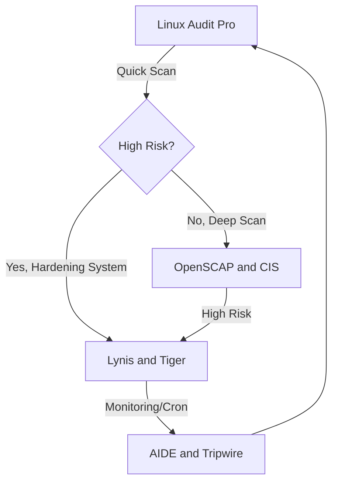

<h1 align="center"> Linux Audit Pro v2.0 🛡️ </h1>

<p align="center">
  
  
</p>

**Professional Linux security auditing tool that generates interactive HTML reports with risk assessment and compliance mapping.**
<br>

## 📦 Features

### 🔍 Comprehensive Audits
- **System Information**
- **User & Group Audit**
- **SSH Configuration**
- **Firewall Status**
- **Password Policies**
- **Software Updates**
- **Logging & Monitoring**
- **Developer Tools**
- **Secret Leakage**
- **Prohibited Software**
- **Disk Encryption**
- **File Integrity**
- **SUID/SGID Files**
<br>

### 📊 Smart Reporting
- **Interactive HTML dashboard**
- **Risk prioritization (High/Medium/Low)**
- **Compliance mapping (CIS, NIST, ISO 27001)**
- **Executive summary**

<br>


<br>

## 📥 Installation Methods

### Method 1: Using Git Clone (Recommended for Developers)

```bash
# Clone the repository
git clone https://github.com/deka1918/Linux-Audit-Pro-v2.0.git
cd Linux-Audit-Pro-v2.0

# Make the installer executable and run
chmod +x install-audit-pro.sh
sudo ./install-audit-pro.sh
```

### Method 2: Direct Download (Quick Install)

```bash
# Download the installer
wget https://github.com/deka1918/Linux-Audit-Pro-v2.0/raw/main/install-audit-pro.sh

# Make executable and install
chmod +x install-audit-pro.sh
sudo ./install-audit-pro.sh
```

<br>

## 🖥️ Usage Guide

### Launch the tool:

| Method | Command | Description |
|--------|---------|-------------|
| Terminal | `audit-pro` | Run with terminal interface |
| Desktop | Search **Linux Audit Pro** in app menu | GUI launcher |


### When launched, you'll see these profile options:

   ```text
   ╔══════════════════════════════════════════════════╗
   ║            🛡️ Linux Audit Report v2.0            ║
   ╚══════════════════════════════════════════════════╝
   Select audit profile:
   1) SysAdmin    - Server health focus
   2) Developer   - Secret leakage & tools
   3) Finance     - High-security workstations
   4) Security    - Comprehensive deep audit
   5) EndUser     - Basic desktop checks
   6) All         - Full system scan (Default)

   Enter choice [1-6]: _
   ```

### Generating Reports
  - HTML report automatically saved as: `AuditReport-xx-date.html`
  - Opens in default browser

<br>

## 🗑️ Uninstallation

```bash
# Remove main components
sudo rm -f /usr/local/bin/audit-pro \
           /usr/share/applications/audit-pro.desktop \
           /usr/local/bin/audit-icon.png

# Update desktop database
sudo update-desktop-database
```

<br>

## 🔧 Troubleshooting Guide

### GPG Verification Failed

```bash
# Re-download and verify manually
wget https://github.com/deka1918/Linux-Audit-Pro-v2.0/releases/download/v2.0.0/public-key.asc

gpg --import public-key.asc
gpg --verify Linux_Audit_Pro-x86_64.AppImage.asc
```

### Permission Denied Errors
- Run with `sudo`

### Missing Dependencies
```bash
# Install required tools
sudo apt update && sudo apt install -y libfuse2 gnupg coreutils
```
### No icons in report
- Check internet connection for Font

<br>

## 📌 Important Notes

### Compatibility:
- Tested on Ubuntu/Debian/Fedora/RHEL/CentOS
- openSUSE/Arch/Manjaro Core features work, needs adjustments

### Feedback:

- Report issues at:

```bash
https://github.com/deka1918/Linux-Audit-Pro-v2.0/issues
```

<br>

## What's next?


